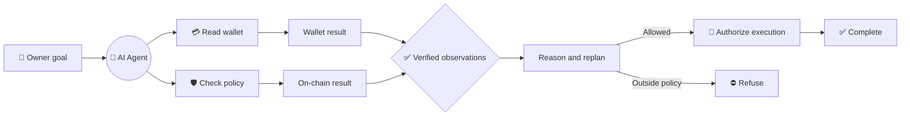
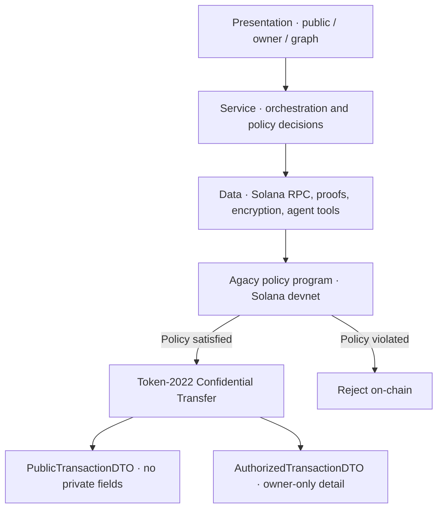

<div align="center">

# 🛡️ Agacy

### Private execution for autonomous agents on Solana

Give an AI agent a goal—not unrestricted access to your wallet.

[](https://ntu-cctf-snz-innovatex-2026.devpost.com/)
[](https://explorer.solana.com/?cluster=devnet)


</div>


## ⚡ The 20-second pitch

AI agents can already make on-chain payments, but their wallets expose operational data and their
spending limits often exist only inside a prompt. A prompt-injected or malfunctioning agent can
ignore those instructions.

**Agacy gives an autonomous agent a confidential wallet with an owner-controlled policy that is
enforced on-chain.** Transfer amounts, policy limits, and agent reasoning remain confidential while
the owner retains a complete authorized audit view.

> The model decides what to do. The policy decides what it is allowed to do.

## 🎯 One product, three proofs

| | What Agacy proves | Why it matters |
|---|---|---|
| 🧠 **Autonomous execution** | A goal becomes a live, recursive execution graph with model-selected tools, branching, merging, replanning, and honest refusal. | The agent is not a hard-coded payment form. |
| 🔐 **Confidential activity** | Token-2022 Confidential Transfer hides amounts; encrypted memos protect reasoning; separate public and owner DTOs prevent UI-layer leaks. | Competitors and attackers cannot read the agent's financial intent. |
| ⛓️ **Unbypassable policy** | A Solana program controls the spending path, enforces encrypted per-transfer and rolling limits, and rejects mismatched proofs or over-limit attempts. | A prompt injection cannot negotiate with an on-chain constraint. |

## 🕸️ Live agent execution graph

The owner gives one natural-language command. Agacy's AI agent decides which available tools to use,
executes them, merges verified observations, and expands the graph until it completes or reaches a
real capability boundary.



The graph is an observable execution DAG, not a blockchain visualization. It makes every agent
decision, tool call, policy check, and refusal understandable during the demo.

## 🎬 Golden demo

1. **Command** — the owner asks the agent to inspect its wallet and complete a payment goal.
2. **Observe** — the graph branches into wallet and on-chain policy checks.
3. **Decide** — verified results merge and the model chooses the next action.
4. **Enforce** — an allowed confidential payment succeeds; an over-limit or amount-mismatch attack
   is rejected by the program.
5. **Compare** — the public view reveals no amount or reasoning, while the authorized owner view
   decrypts the full audit trail.

## 🔎 Public vs. owner view

| Data | 🌍 Public observer | 🔑 Authorized owner |
|---|:---:|:---:|
| Transaction exists | ✅ | ✅ |
| Transfer amount | 🔒 Hidden | ✅ Decrypted |
| Confidential balance | 🔒 Hidden | ✅ Decrypted |
| Agent reasoning | 🔒 Ciphertext only | ✅ Decrypted |
| Spend-policy limits | 🔒 Encrypted | ✅ Available |
| Timing, fees, and program interaction | ⚠️ Visible | ✅ Visible |

Agacy is **confidential, not magically anonymous**. The current prototype does not claim to hide
all timing metadata, transaction fees, program interaction, or every form of address linkability.

## 🏗️ Architecture



- **Chain:** Solana devnet
- **Privacy rail:** Token-2022 Confidential Transfer + ZK ElGamal Proof program
- **Policy enforcement:** custom Rust/Anchor custody program
- **Agent:** Solana Agent Kit + Vercel AI SDK tool-calling loop
- **Application:** Next.js 15, React 19, TypeScript, `@solana/kit`
- **Reasoning encryption:** AES-GCM via Web Crypto, ciphertext carried in an SPL Memo

## ✅ Verified on devnet

| Evidence | Result |
|---|---|
| [Confidential transfer](https://explorer.solana.com/tx/5vTuKeoULGc26FdNoxCVErWbYzet1jReDhgRqvp2Le9erDsWTx8p4P4VCGotC9mwFHaifazLeAbzq2mpCLwqAEtz?cluster=devnet) | Real Token-2022 transfer with the amount absent from readable account data |
| [Spend-policy program](https://explorer.solana.com/address/9sYKkYh1GTKY2whkGPGXuG1VKiYqfiwyjVcpQbYtHtwW?cluster=devnet) | Deployed policy account that the agent cannot modify |
| Program-owned custody | In-policy confidential payment signed; over-limit and ownership-seizure attempts rejected |
| Amount binding | A valid `claim 1 / transfer 25` proof-mismatch attack is rejected |
| Confidential audit trail | Agent reasoning is encrypted and absent from raw transaction plaintext |

The evidence is reproducible—judges do not have to trust screenshots or the model's narration.

```bash
npm run capture-proof
npm run verify-custody
npm run verify-confidential-limits
npm run verify-attacks
```

## 🏆 Why Agacy fits InnovateX

Agacy targets **Track 2: Web3 Applications, AI Agents & Real-World Use Cases**.

| Official criterion | Weight | Agacy's evidence |
|---|:---:|---|
| Technical Quality | **30%** | Working devnet program, confidential transfers, adversarial verification, typed privacy boundary, automated tests |
| Real-World Impact | **25%** | Safe delegation for treasury, procurement, and other payment agents |
| Innovation | **20%** | Confidential agent intent plus encrypted, on-chain-enforced spending limits |
| Demo & Presentation | **15%** | One visual graph and a side-by-side public/owner privacy reveal |
| Track Relevance | **10%** | An autonomous, user-facing Web3 agent solving a concrete financial-control problem |

Criteria source: [NTU InnovateX Hackathon 2026 on Devpost](https://ntu-cctf-snz-innovatex-2026.devpost.com/).

## 🚀 Run locally

**Requirements:** Node.js 22+, npm, and optionally a funded Solana devnet keypair for live proof
scripts.

```bash
git clone https://github.com/fatraelkarizm/Agacy.git
cd Agacy
npm install
npm run dev
```

Open `http://localhost:3000`, connect a wallet, and enter the dashboard. Click the central **AI
Agent** node—or right-click anywhere on the graph canvas—to issue an owner command.

```bash
npm test          # unit test suite
npm run typecheck # TypeScript boundary checks
npm run build     # production build
```

<details>
<summary><strong>Optional environment variables</strong></summary>

```bash
# Only required for the model-driven autonomous agent
LLM_API_KEY=sk-...
BASE_URL=https://api.openai.com/v1

# Optional devnet overrides; proof scripts otherwise use the Solana CLI keypair
AGACY_RPC_URL=https://api.devnet.solana.com
AGACY_PAYER_SECRET_KEY=[1,2,3,...]
```

</details>

## 🧭 Deliberate scope

The hackathon prototype focuses on one defensible loop: **goal → agent decision → confidential
payment → on-chain enforcement → authorized audit**.

Multi-chain support, an arbitrary MCP marketplace, public identity/reputation, lending, and a
general-purpose multi-agent platform are intentionally out of scope. They add surface area without
making the core privacy claim stronger.

---

<div align="center">

**Autonomy without unlimited authority. Privacy without unverifiable promises.**

Built for NTU InnovateX Hackathon 2026.

</div>
