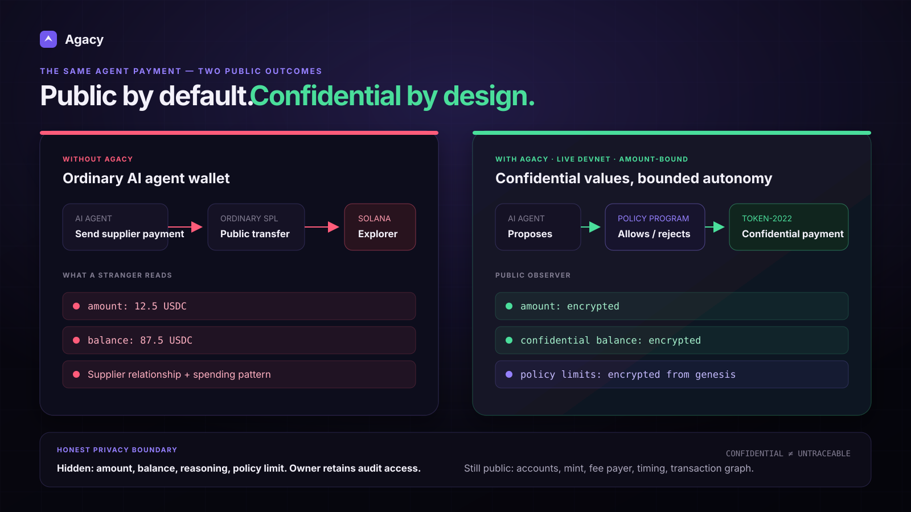
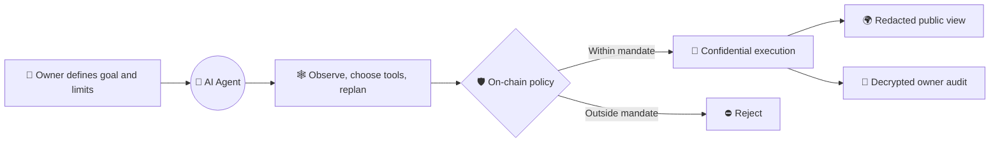
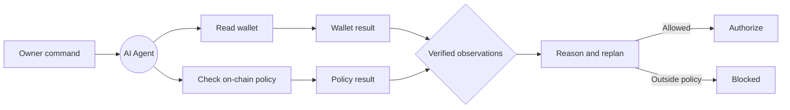
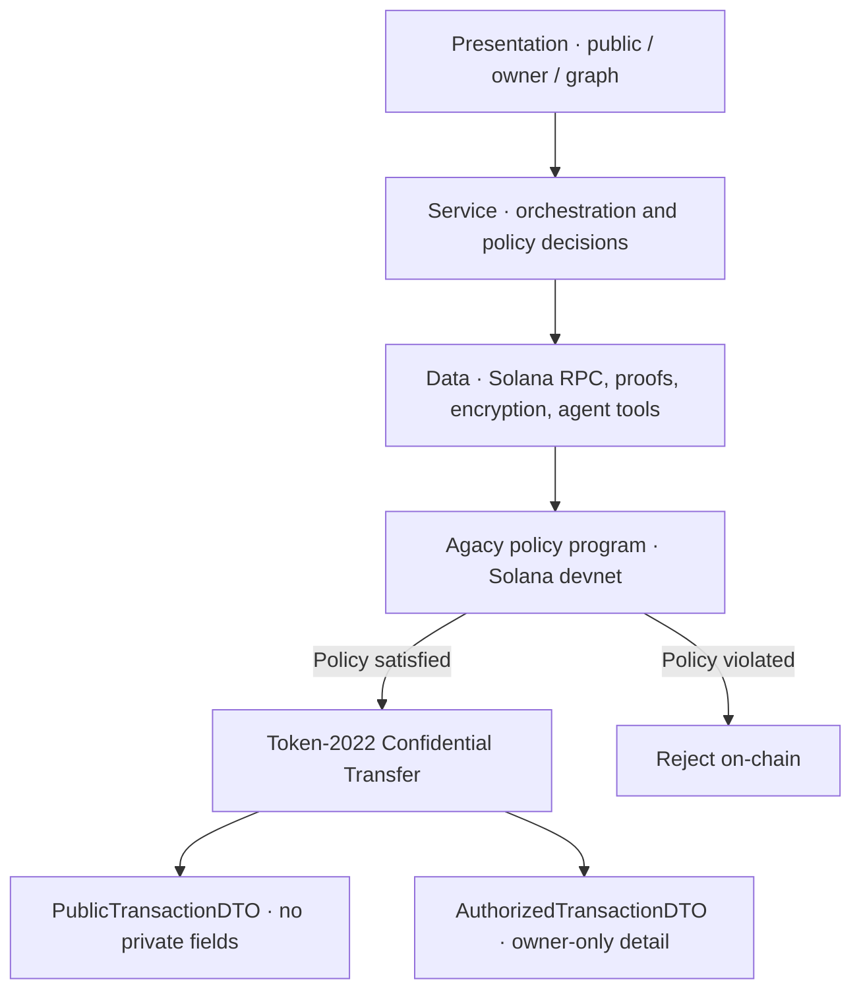

<div align="center">

# 🛡️ Agacy

### Private execution for autonomous agents on Solana

Give an AI agent a goal—not unrestricted access to your wallet.

[](https://ntu-cctf-snz-innovatex-2026.devpost.com/)
[](https://explorer.solana.com/?cluster=devnet)


</div>



## 📋 Project Details

| Devpost field | Submission |
|---|---|
| **Project title** | Agacy |
| **Selected track** | Track 2 — Web3 Applications, AI Agents and Real-World Use Cases |
| **Team type** | Student Group |
| **Prototype status** | Functional prototype on Solana devnet |
| **Short description** | Agacy is a confidential wallet and execution layer for autonomous AI agents. Owners delegate goals and bounded spending authority; the agent chooses how to act while encrypted, on-chain policy prevents it from exceeding its mandate. |

> **The model decides what to do. The policy decides what it is allowed to do.**

## 🎯 Project Overview

### The problem

AI agents are beginning to pay for APIs, infrastructure, datasets, suppliers, subscriptions, and
other agents. The wallet infrastructure beneath them still has two dangerous defaults:

1. **Their financial activity is public.** Once an agent wallet is linked to a company, DAO, or
   person, observers can profile balances, payment amounts, supplier relationships, operating
   cadence, and treasury runway.
2. **Their spending policy is often only a prompt.** A system instruction such as “never spend more
   than 20 USDC” is guidance to the model, not a security boundary. Prompt injection, faulty
   reasoning, or concurrent tool calls can cause the agent to ignore it.

This creates a bad choice for an owner: approve every payment manually and lose the value of
autonomy, or give an agent a visible wallet with authority that is too broad.

### The proposed solution

**Agacy separates intelligence from authority.** The owner gives an AI agent a natural-language
goal and a bounded spending mandate. The agent can inspect its environment, select tools, branch
into subtasks, and replan autonomously—but every value-moving action must pass an owner-controlled
policy enforced outside the model.

Approved payments use Token-2022 Confidential Transfer. Amounts and balances stay encrypted,
policy limits can be enforced without being published as plaintext, and agent reasoning is stored
as encrypted audit data. The public sees a verifiable transaction; the authorized owner retains the
details needed to understand and audit it.

### Why Agacy

Privacy alone does not make an agent safe, and a spend limit alone does not make it private. Agacy
combines the controls that a production agent wallet needs in one execution path:

| Approach | Autonomous | Financial data confidential | Limit outside the model | Owner audit |
|---|:---:|:---:|:---:|:---:|
| Manual wallet approval | ❌ | ❌ | ✅ | ✅ |
| Ordinary agent wallet | ✅ | ❌ | ❌ | ✅ |
| Model-only spending rule | ✅ | ❌ | ❌ | ✅ |
| **Agacy** | ✅ | ✅ | ✅ | ✅ |

The result is not another chatbot or wallet dashboard. Agacy is the **privacy and authority layer
between an AI agent's decisions and the owner's funds**.

### Key features

- 🕸️ **Live autonomous execution graph** — one owner command becomes a recursive graph of model-
  selected observations, tool calls, policy checks, merged results, replanning, and honest refusal.
- 🔐 **Confidential payments** — Token-2022 Confidential Transfer hides transfer amounts and
  confidential balances using Solana's ZK proof infrastructure.
- ⛓️ **Encrypted on-chain spending policy** — per-transfer and rolling-period limits are enforced by
  a deployed program, not negotiated with the model.
- 🧾 **Private reasoning audit trail** — concise agent reasoning is encrypted with AES-GCM and
  carried as ciphertext in an SPL Memo.
- 👁️ **Structurally separate views** — public and authorized transaction DTOs are different types;
  public UI code cannot accidentally receive decrypted fields.
- 🧪 **Adversarial proof** — over-limit, amount-mismatch, replay, unauthorized CPI, and custody-
  seizure attempts are tested against the real devnet program.
- 🔑 **Owner recovery** — the owner can take custody back without depending on the agent's budget
  or cooperation.

## 👥 Target Users and Scale

### Initial users

| User | What they delegate | Why Agacy matters to them |
|---|---|---|
| **DAO treasury operators and multisig signers** | Contributor payouts, grants, infrastructure, recurring operations | They need bounded automation without exposing runway, recipient amounts, or payment cadence to competitors and attackers. |
| **Startup and SME finance/procurement teams** | Supplier invoices, SaaS renewals, API credits, cloud and compute purchases | Public payments can reveal supplier pricing, vendor relationships, and operating velocity; manual approval does not scale with frequent small purchases. |
| **Web3 protocols and agent platforms** | Keeper costs, data feeds, compute, settlement, and agent-to-agent services | An always-on agent needs machine-speed payments, but the protocol still needs cryptographic limits and an owner-readable audit trail. |
| **Individual power users** | Subscriptions, trading tools, data purchases, and personal automation | They want delegation without publishing a permanent financial profile or giving a model unlimited authority. |

### Each of those users, actually run

The four rows above were a claim about who this is for. Below is each one driven
through the Agent Graph as a real goal on Solana devnet — the agent chose its own
tools, and every payment is a Token-2022 confidential transfer whose amount was
then read back from the recipient's account bytes to confirm it is unreadable.

| Persona | Goal given to the agent | Tools the agent chose | Confidential transfer | Wall clock |
|---|---|---|---|---|
| **DAO treasury operator** | Contributor payout is due — check the wallet, search for any Solana security incident that should stop it, then pay 2 tokens confidentially | `get_wallet_overview`, `research_counterparty`, `cross_check_token_price`, `pay_confidentially` | [`4K3Pwvq1…`](https://explorer.solana.com/tx/4K3PwvQ1qusP1VWyVLxH8tGHUGoH6q993RGNW7Z8QFhcm6x8LLwSzjDWZ9vn65PB2mVWYQQU8VrYWXMxVzVvptZs?cluster=devnet) · 21.9s · **amount not readable** | 50s |
| **Startup / SME procurement** | SaaS vendor invoice — price SOL, cross-check it independently, then pay 1 token confidentially so supplier pricing stays private | `get_token_price`, `cross_check_token_price`, `research_counterparty`, `pay_confidentially` | [`4u5vP4kx…`](https://explorer.solana.com/tx/4u5vP4kxPmCSZmfAoHFX2TYpKiF61UZM1V9sMv3cCSGf7GiHy4E8UY9HLhFHR8EAxHZvUfhG8nTZkAhu8vpdzsWb?cluster=devnet) · 21.9s · **amount not readable** | 62s |
| **Web3 protocol / agent platform** | Settling a keeper's fee — cross-check the price against an independent source, check the wallet, then settle 1 token confidentially | `cross_check_token_price`, `get_wallet_overview`, `pay_confidentially` | [`4Vzr2fqV…`](https://explorer.solana.com/tx/4Vzr2fqVQGwrjQsCNNMcEZzvg2nnsMuJE9DRsVuE4VRRpTY2qfnwxQq4EpxpaySHyFHFGZtHf2UNLCAWwzVVSvEu?cluster=devnet) · 22.0s · **amount not readable** | 62s |
| **Individual power user** | Renew a monthly data subscription — check for any recent incident, price SOL, then pay 1 token confidentially | `research_counterparty`, `get_token_price`, `pay_confidentially` | [`3fB2TQ9v…`](https://explorer.solana.com/tx/3fB2TQ9veNdwuVFj71ywUPg3hv9hg79UdKcby8hd5dRB6KcmVGY1DZdSs5zdKZBV6nWPTGy8WmNDUxh1SD58RwnL?cluster=devnet) · 22.1s · **amount not readable** | 52s |

Screenshots: [DAO](public/graph/persona-1-dao-treasury.png) · [SME](public/graph/persona-2-sme-procurement.png) · [Protocol](public/graph/persona-3-protocol-keeper.png) · [Individual](public/graph/persona-4-individual.png). First-expansion planning for all four is captured in `server/data/persona-runs.json` (`npm run personas`).

#### What a run costs and how long it takes

| Step | Latency | Cost |
|---|---|---|
| Model expansion (one node) | 1.5–10s, 7–8 per goal | Token cost not yet measured |
| AIsa data call (`cross_check_token_price`, `research_counterparty`) | 0.5–2.4s | **$0.0080 per call**, billed by AIsa |
| Confidential transfer (`pay_confidentially`) | **21.9–22.1s**, 6 Solana transactions | 45,000 lamports (~$0.003) |
| Ordinary SPL transfer, for comparison | 0.9s, 1 transaction | 5,000 lamports |
| **Whole goal, end to end** | **50–62s** | ~$0.02 per run at 1–2 AIsa calls |

Two honest notes. **Latency, not cost, is the constraint** — confidentiality adds
about $0.003 to a payment but takes 22 seconds instead of one, because three ZK
proofs must verify into context accounts before the transfer instruction runs.
That rules out latency-sensitive uses and does not affect the invoice,
subscription and treasury workflows above. And **the model's token cost is not
measured yet**; only the call count is. Everything else in this table was read
from a meter or a clock, not estimated.

`pay_confidentially` moves tokens on a devnet demo mint held by the server, not
owner funds, and the agent's own summary says so in every run.

### Market size

| | Size today | What it means for Agacy |
|---|---|---|
| **TAM** — all AI-agent-initiated value movement | AI agent market projected to reach **US$52.62B by 2030**, with **79% of organizations** already reporting some AI agent adoption | Every one of those agents that touches money eventually needs an authority boundary. That boundary is the product, independent of which chain or app the agent runs on. |
| **SAM** — on-chain agent payments specifically | Stablecoin transaction volume hit **US$33T in 2025**; DAOs alone hold **US$21–24.5B** in on-chain treasury assets across **13,000+ organizations** | This is the addressable slice where a wallet-level, on-chain-enforced policy is possible at all — it needs programmable money, which is what Agacy is built on. |
| **SOM — Stage 1** | Agent-initiated payments are still **~0.0001%** of stablecoin volume today | The category is early, not proven at scale — which is the argument for building the trust and privacy layer now, before volume arrives, rather than retrofitting it after an incident. |

Read together: the market Agacy targets is not speculative in size (DAO treasuries and stablecoin
settlement already move tens of billions), but agent-initiated spend inside it is still near zero —
so the opportunity is to be the default policy layer before that curve bends up, not to compete for
share of an already-saturated one. See sources in the evidence table below.

### External evidence for the problem

Agacy's two starting claims — "agent spending is becoming real money" and "a prompt-level spend
limit is not a security boundary" — are not internal assumptions. Both are documented independently:

| Claim | External evidence | Source |
|---|---|---|
| Prompt-level spend limits fail under adversarial input, not just in theory | An attacker sent a Morse-code prompt injection to the Grok/Bankrbot agent on X and moved 3B DRB tokens (~US$150K–200K) out of a linked wallet — no private key stolen, no contract exploited, just a system-prompt instruction talked around | [OECD.AI incident record](https://oecd.ai/en/incidents/2026-05-04-4a73) · [SecurityWeek](https://www.securityweek.com/prompt-injection-attacks-trick-ai-agents-into-making-crypto-payments/) · [Giskard](https://www.giskard.ai/knowledge/how-grok-got-prompt-injected-an-x-user-drained-150-000-from-an-ai-wallet) |
| Public on-chain payment history is a real institutional blocker, not a hypothetical preference | Public transparency exposes salary, vendor pricing, and treasury runway to competitors; this is cited as a specific reason traditional companies and B2B payment operators avoid transacting on fully public chains | [Fireblocks — The Blockchain Privacy Problem](https://www.fireblocks.com/blog/blockchain-privacy-problem) · [Outlook India — Transparency in DAO Treasuries](https://www.outlookindia.com/xhub/blockchain-insights/transparency-in-dao-treasuries-the-role-of-on-chain-tracking-and-public-financial-reporting) |
| The treasury-operator user segment is a real, sizeable market, not a hackathon persona | 13,000+ DAOs collectively manage roughly US$21–24.5B in liquid treasury assets today | [Nevermined — Agent-to-Agent Payment Statistics](https://nevermined.ai/blog/agent-to-agent-payment-statistics) |
| Agents making autonomous payments is an early but accelerating category, matching Agacy's "get the trust layer right before volume arrives" framing | 79% of organizations report having adopted AI agents, in a market projected to reach US$52.62B by 2030; total stablecoin volume was US$33T in 2025, but agent-initiated payment activity is still ~0.0001% of it — early enough that the control layer isn't a solved problem yet | [Nevermined — Agent-to-Agent Payment Statistics](https://nevermined.ai/blog/agent-to-agent-payment-statistics) |

These are cited as directional market context, not project-specific validation — Agacy has not yet
run a pilot with a named DAO, SME, or protocol. That remaining gap is the weakest part of the
Real-World Impact case and the next thing worth closing.

### Scale path

Agacy starts with a narrow, high-value workflow: **a procurement or treasury agent making bounded
confidential payments**. The same execution boundary can then protect multiple agents across one
organization, reusable payment tools across agent platforms, and eventually any AI workflow that
can request an on-chain transaction.

The scalable product is not one specialized procurement bot. It is a wallet-level policy and
privacy layer that different agents can use while owners keep control. Broader tool and MCP
integration is an expansion path after the core confidential-payment guarantee is production-ready,
not a dependency for this hackathon prototype.

## 🔄 How the Product Works



1. The owner connects a Solana devnet wallet.
2. The owner names the agent, chooses its purpose, and sets per-transfer and period limits.
3. Agacy provisions a policy account that the agent cannot modify.
4. The owner gives the agent a goal in natural language.
5. The agent expands the goal into an observable execution graph and calls verified tools.
6. Every spend is evaluated against the policy path before execution.
7. The public sees redacted transaction data; the owner can inspect decrypted detail and reasoning.

### Example agent graph



This is a live execution DAG—not a decorative blockchain diagram. Nodes are generated from the
owner's goal, and tool-result nodes are created only after the runtime has executed and verified the
corresponding tool.

## 🔎 What Privacy Looks Like

| Data | 🌍 Public observer | 🔑 Authorized owner |
|---|:---:|:---:|
| Transaction exists | ✅ | ✅ |
| Transfer amount | 🔒 Hidden | ✅ Decrypted |
| Confidential balance | 🔒 Hidden | ✅ Decrypted |
| Agent reasoning | 🔒 Ciphertext only | ✅ Decrypted |
| Spend-policy limits | 🔒 Encrypted | ✅ Available |
| Timing, fees, and program interaction | ⚠️ Visible | ✅ Visible |

Agacy is **confidential, not magically anonymous**. The current prototype does not claim to hide
timing, fees, program interaction, or every form of address linkability.

## 🏗️ Technical Architecture



### Technologies

| Layer | Technology | Role |
|---|---|---|
| Blockchain | Solana devnet | Settlement, policy state, and verifiable program execution |
| Confidentiality | Token-2022 Confidential Transfer, `@solana/zk-sdk`, ZK ElGamal Proof program | Encrypt amounts/balances and verify transfer proofs |
| Policy | Rust + Anchor program with PDA-owned custody | Enforce spend limits and restrict the signing path |
| Agent | Solana Agent Kit, Vercel AI SDK, OpenAI-compatible model | Goal-driven tool selection and recursive graph expansion |
| Application | Next.js 15, React 19, TypeScript, `@solana/kit` | Owner onboarding, public/authorized views, and graph UI |
| Audit encryption | AES-GCM via Web Crypto + SPL Memo | Store reasoning ciphertext for owner-authorized review |

## ✅ Supporting Materials and Devnet Evidence

| Material | What it demonstrates |
|---|---|
| [Privacy comparison diagram](public/agacy-privacy-compare-flow.svg) | Ordinary public agent wallet versus Agacy's confidential, policy-bound path |
| [Encrypted-core visual](public/agacy-encrypted-core.png) | Product privacy model and protected data boundary |
| [Prototype demo clip](public/agacy-private-core.mp4) | Current application concept and interaction direction |
| Embedded architecture diagrams above | Agent, policy, Token-2022, and public/authorized data flow |
| [Confidential transfer on devnet](https://explorer.solana.com/tx/5vTuKeoULGc26FdNoxCVErWbYzet1jReDhgRqvp2Le9erDsWTx8p4P4VCGotC9mwFHaifazLeAbzq2mpCLwqAEtz?cluster=devnet) | Real Token-2022 confidential transfer |
| [Deployed spend-policy program](https://explorer.solana.com/address/9sYKkYh1GTKY2whkGPGXuG1VKiYqfiwyjVcpQbYtHtwW?cluster=devnet) | Policy account and program execution on Solana devnet |

Reproduce the security claims instead of trusting screenshots:

```bash
npm run capture-proof
npm run verify-custody
npm run verify-confidential-limits
npm run verify-attacks
```

Verified behaviors include a real confidential payment signed through program-owned custody,
rejection of an over-limit spend, rejection of a valid `claim 1 / transfer 25` proof mismatch, and
owner recovery of the custodied account.

## 🚀 Run the Application

### Prerequisites

- Node.js 22 or newer and npm.
- A Solana browser wallet configured for devnet.
- Devnet SOL for policy provisioning and live transactions.
- An OpenAI-compatible API key for the model-generated Agent Graph.

### 1. Install

```bash
git clone https://github.com/fatraelkarizm/Agacy.git
cd Agacy
npm install
```

### 2. Configure

```bash
cp .env.example .env.local
# Windows PowerShell: Copy-Item .env.example .env.local
```

Set `LLM_API_KEY` in `.env.local`. `BASE_URL` and `LLM_MODEL` let you use another
OpenAI-compatible endpoint and model. The public Solana devnet endpoints work by default; a private
RPC is recommended for repeated live verification.

### 3. Start

```bash
npm run dev
```

Open `http://localhost:3000` and follow this demo path:

1. Connect the owner wallet.
2. Create an agent and choose a purpose such as **Procurement**.
3. Set the spending policy and choose **Confidential** visibility.
4. Review and sign the devnet policy-account transaction.
5. Open **Agent Graph**, click the central **AI Agent** node—or right-click the canvas—and enter a
   natural-language command.
6. Watch wallet and policy reads branch, merge into verified observations, and continue to an
   authorization or refusal.
7. Use the dashboard's public/owner comparison and attack controls to explain the privacy and
   enforcement guarantees.

### 4. Verify

```bash
npm test
npm run typecheck
npm run build
```

The standalone autonomous devnet flow is available through `npm run agent`. It provisions a fresh
confidential environment and lets the model choose tools against real devnet state.

## 🧭 Deliberate Hackathon Scope

The prototype focuses on one defensible loop:

**owner goal → autonomous decision → confidential payment → on-chain enforcement → owner audit**

Multi-chain support, a general MCP marketplace, public identity/reputation, lending, and a general-
purpose multi-agent platform are intentionally outside the Stage 1 scope. They do not make the core
privacy and policy claim stronger.

---

<div align="center">

**Autonomy without unlimited authority. Privacy without unverifiable promises.**

Built for NTU InnovateX Hackathon 2026.

</div>
